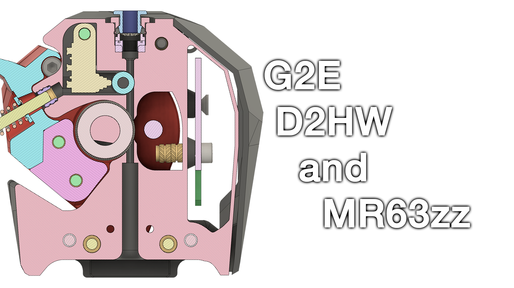
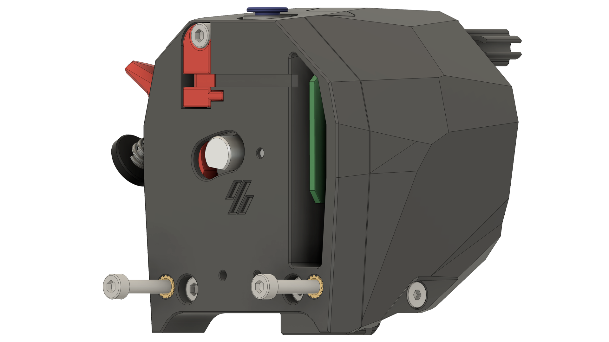

### Galileo 2 Remix with Pre-Extruder Gear Filament Sensor

#### Description:
This is a remix of the [**Galileo 2 extruder**](https://github.com/JaredC01/Galileo2) by JaredC01, designed to integrate a **pre-extruder gear filament sensor** using the **Omron D2HW-C01 microswitch and MR63ZZ combo**, inspired by the ingenious [**Box Turtle**](https://github.com/ArmoredTurtle/BoxTurtle) design by Armored Turtle. The addition of this sensor provides filament monitoring, while enhancing reliability as opposed to the D2H/5mm Ball bearing combo seen previously on other design...

This remix also modifies the geometry of the **Stealburner unit**, as the tight fit of the chosen microswitch required slight adjustments.

#### Features:
- Integration of a **pre-extruder gear filament sensor** for improved filament tracking.
- Enhanced operational stability for frequent tool changes, addressing known issues with Galileo's design.
- Slightly modified filament path to better accommodate the new sensor setup.

#### Bill of Materials (BOM):
- **1x Omron D2HW-C201H microswitch**
- **1x MR63ZZ bearing**
- **1x M3 Voron spec heat insert**
- **1x M3x10 SHCS screw**

#### Notes:
- Ensure proper alignment of the sensor with the filament path for accurate detection.
- Verify your printer's tuning before printing and assembling this modification.

#### Assembly:
The CAD files are included to guide the assembly process. Contributions and feedback are highly encouraged to further refine the design. 

Feel free to suggest edits or add more details if needed!

---

[If you enjoy my work, consider supporting me by buying me a coffee!](https://buymeacoffee.com/Ntrondle)
